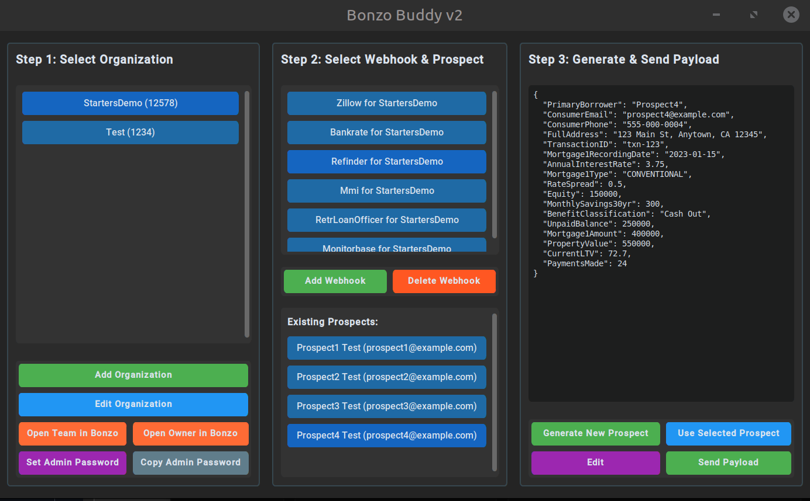

# Bonzo Buddy: Webhook Payload Testing Tool



**Bonzo Buddy** is a professional, Python-based GUI application designed to streamline the process of testing webhook integrations. It provides a robust, intuitive, and stateful environment for managing test organizations, generating dynamic payloads, and verifying integration behavior.

## Core Features

-   **Guided Graphical Interface:** A clean, modern, and step-by-step dark mode interface that guides the user through the testing process, preventing errors and confusion.
-   **Dynamic & Stateful Payload Generation:** Payloads are generated from schemas, with contact information (`firstName`, `lastName`, `email`, `phone`) created dynamically for each new test.
-   **Transactional Prospect Saving:** New prospects are only saved to the "Existing Prospects" list after the webhook returns a successful `200 OK` response, ensuring the list of testable existing contacts is always accurate.
-   **Organization-Scoped Testing:** All generated prospects and webhooks are scoped to a specific organization, allowing for clean, isolated testing environments without data collision.
-   **De-duplication Testing:** Easily resend previously generated (and successfully saved) prospects to test your system's contact merging and de-duplication logic.
-   **Centralized Management:** Manage all your test organizations and their associated webhook endpoints from within the app's clear, three-panel layout.
-   **Extensible by Design:** Easily add new integrations by creating a new directory and a `_schema.json` file. The application will automatically detect and include it.

## Setup and Installation

This project uses `uv`, a modern and extremely fast Python package manager.

1.  **Navigate to the project directory:**
    ```bash
    cd bonzobuddy
    ```

2.  **Create and activate a Python virtual environment:**
    This command creates a `.venv` directory inside your `bonzobuddy` project folder. It's important that you run this command from within the `bonzobuddy` directory.
    ```bash
    python3 -m venv .venv
    source .venv/bin/activate
    ```
    *(On Windows, use `.\venv\Scripts\activate`)*

3.  **Install `uv` (if you don't have it):**
    ```bash
    python3 -m pip install uv
    ```

4.  **Install all dependencies with `uv`:**
    Use `uv` to sync your environment with the dependencies listed in `pyproject.toml`.
    ```bash
    uv sync
    ```

## How to Run the Application

Once the setup is complete, you can run the application from within the `bonzobuddy` directory using the `uv run` command. This ensures the script is executed within the correct virtual environment.

```bash
uv run python app/main.py 
```

## How to Use the Tool

The application is designed to guide you through a simple, three-step process:

1.  **Step 1: Select an Organization**
    *   The application starts with only the "Organizations" panel active.
    *   Select an existing organization or click **"Add Organization"** to create a new, isolated testing environment.

2.  **Step 2: Select a Webhook**
    *   Once an organization is selected, the "Webhooks" panel becomes active.
    *   Select a webhook for the chosen organization, or click **"Add Webhook"** to configure a new endpoint. The tool will guide you in selecting the integration type and automatically name the webhook for you.

3.  **Step 3: Generate & Send**
    *   With a webhook selected, the "Action" panel becomes active.
    *   Click **"Generate New Prospect"** to create a payload with a brand new, unique contact. The contact is held in a "pending" state.
    *   Alternatively, select a prospect from the "Existing Prospects" list and click **"Use Selected Prospect"** to test de-duplication.
    *   Review the generated payload in the viewer, then click **"Send Payload"**.
    *   The response from your endpoint will be printed in the console. If the send was for a *new* prospect and the status code was `200`, the prospect will now be saved to the "Existing Prospects" list.

